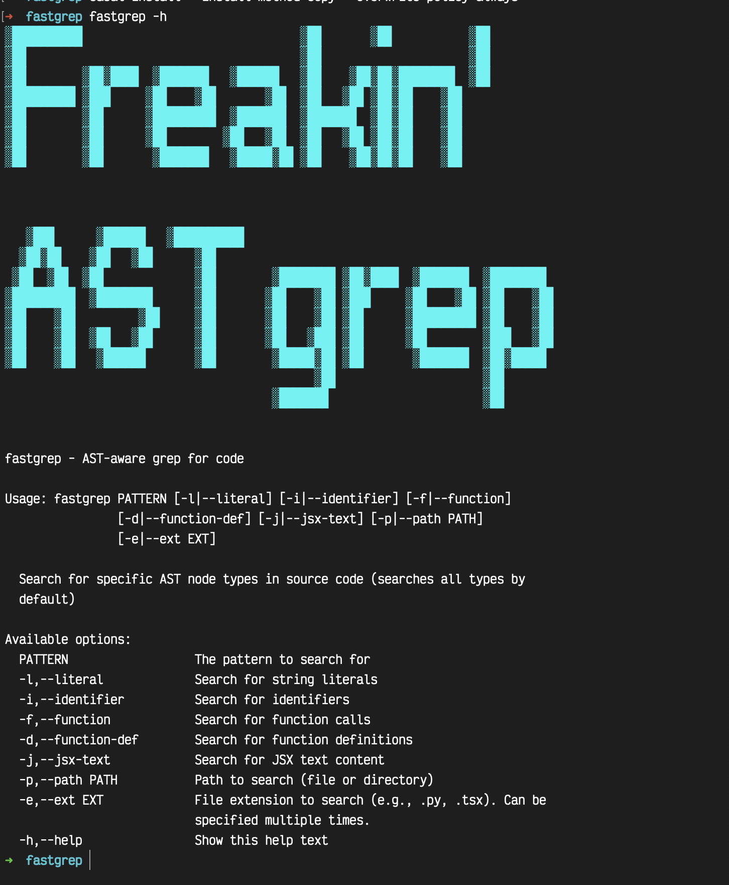

# FASTgrep: Freakin' Abstract Syntax Tree Grep

## Installation

`cabal build`

`cabal install --install-method=copy --overwrite-policy=always`

confirm it works:

`fastgrep`

TODO: distribute a binary

## Why

"I wonder where in the codebase this `Accounts` button is..."

`CMD-F Accounts`

_298 results_

"ok, ok"

`CMD-F Accounts files: .tsx, .js`

_198 results_

"I wish I could just search for inner text or literals that match `Accounts`..."

_viola, FASTGrep_

`fastgrep -j -l Accounts`

## How

It uses the AST to search the codebase based on that grammar that you flag.
It's built on top of treesitter so it works with many langages: [Ruby, Python, Typescript, TSX, Haskell, Go]
It's written in Haskell for no good reason.
It tries to coalesce language grammars to a sane set of flags. i.e haskell and python have different tree sitter nodes
for a function, but we try to be smart about it.

## Usage

Right now we support these nodes:

- literals
- function definitions
- function call sites
- identifiers

And these flags:

 - ext: narrow search to these file extensions
 - path: narrow search to this path

If there is a .gitignore, it will be respected with the search

## disclaimer: it probably isn't acutally that fast
